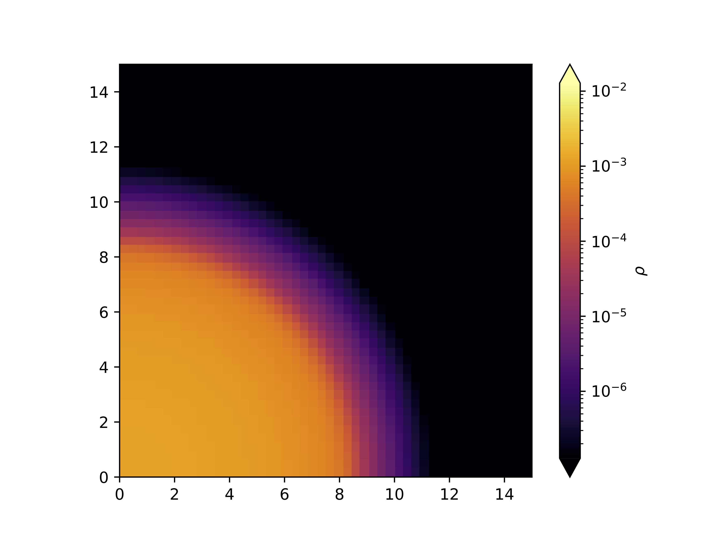
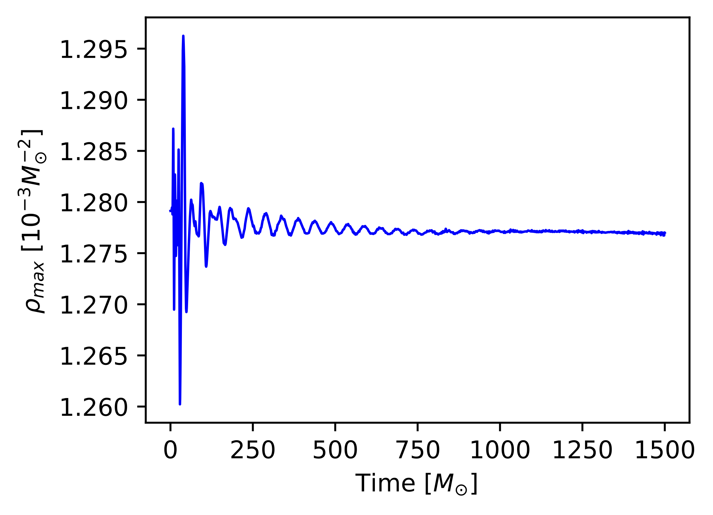

# Athenak Tutorial: TOV Neutron Star

## Install AthenaK

Follow the [wiki](https://github.com/IAS-Astrophysics/athenak/wiki/) page of AthenaK to download it. To build and install:
```
mkdir build
cd build
cmake -D Kokkos_ARCH_NATIVE=ON -D PROBLEM=dyngr_tov [Directory of CMakeLists.txt]
make -j
```
The executable will be created at `build/src/athena`. The option `-D PROBLEM=dyngr_tov` is to specify the problem generator for the static NS. Problem generator files are located under `src/pgen/`.

To compile with MPI, add the option: `-D Athena_ENABLE_MPI=ON`.

## Run simulation

### On Mac

First, create an individual directory under the top AthenaK directory for the specific run:
```
mkdir runs
cd runs
mkdir staticNS
cd staticNS
```
Copy the input file given by AthenaK to the current directory:
```
cp ../../inputs/dyngr/mag_tov.athinput ./
```
Then run the executable:
```
../../build/src/athena -i mag_tov.athinput time/nlim=100
```
Output files are saved under `runs/staticNS/`.

To run with MPI:
```
mpirun -np 4 ../../build/src/athena -i mag_tov.athinput
```

### On Perlmutter using GPUs

CMake configuration:
```
cmake -D Athena_ENABLE_MPI=ON \
      -D Kokkos_ENABLE_CUDA=ON \
      -D Kokkos_ENABLE_CUDA_CONSTEXPR=ON \
      -D Kokkos_ENABLE_CUDA_LAMBDA=ON \
      -D Kokkos_ARCH_AMPERE80=ON \
      -D Kokkos_ARCH_ZEN3=ON \
      -D Kokkos_ENABLE_IMPL_CUDA_MALLOC_ASYNC=OFF \
      -D PROBLEM=dyngr_tov \
      [Directory of CMakeLists.txt]
```
Run AthenaK in interactive jobs:
```
srun [Path to the executable] -i [Path to the parfile] -d [Path to the output directory]
```

## Use tabulated EoS

We use [PyCompOSE](https://github.com/computationalrelativity/PyCompOSE/tree/master) to generate tabulated EoS (with the `.athtab` extension). Download the files listed in the header of the scripts in [PyCompOSE](https://github.com/computationalrelativity/PyCompOSE/tree/master), including all files from https://compose.obspm.fr, and `.h5` and `.pizza` files from Zenodo. Set the input argument `dyn_eos = compose` and add `table = PATH_TO_THE_TABLE` (3-D) in the `<mhd>` block. Add `table = PATH_TO_THE_TABLE_SLICE` (at 0 temperature) in the `<problem>` block.

[PyCompOSE](https://github.com/computationalrelativity/PyCompOSE/tree/master) offers conversion to EoS tables with not-quite-transcendental functions (see [AthenaK Wiki](https://github.com/IAS-Astrophysics/athenak/wiki/DynGRMHD-Equations-of-State#tables-with-not-quite-transcendental-functions)). It generates an HDF5 table and needs to use this [script](https://github.com/jfields7/table-reader/blob/main/tools/hdf5toathtab.py) to convert to a `.athtab` table.
```
python hdf5toathtab -i [HDF5 table path] -o [Output path] -d
```
Here `-d` is to use double precision. Add `use_NQT=true` in the `<mhd>` block, to enable AthenaK to read NQT tables.

## Plot

### Plot a 2-D density slice

Use `plot_image.py` from https://github.com/jfields7/plot-tools. Since the generated binary files are 3-D, we need to specify a slice location to make a 2-D plot.
```
image = Image("../bin/tov.mhd_w_bcc.00001.bin", extent, "dens", slice_loc=['z', 0.0])
```
<p align="center">
  
</p>

### Plot $\rho_{\mathrm{max}}$ evolution
A file named `tov.user.hst` stores the evolution of the maximum density $\rho_{\mathrm{max}}$ with time. Use [plot_rhomax_time.py](https://github.com/ruochengzhai/athenak-tutorial-staticNS/main/plot_rhomax_time.py) to plot it.
<p align="center">
  
</p>

