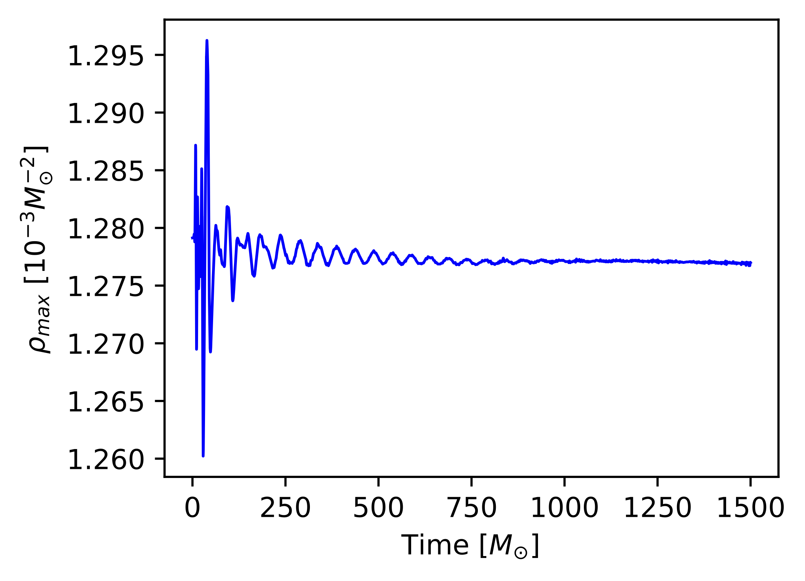
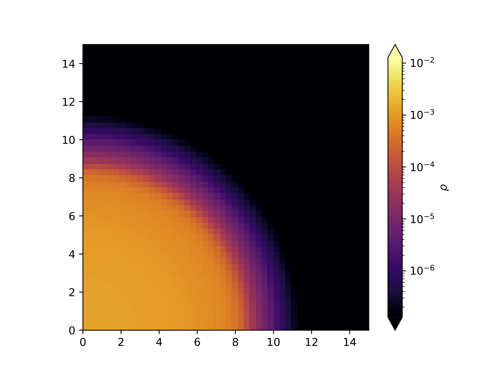

# AthenaK Tutorial: A Static (Magnetized) TOV Neutron Star

This tutorial walks you through setting up, running, and analyzing a simulation
of a single isolated neutron star with [`AthenaK`](https://github.com/IAS-Astrophysics/athenak).
The star is constructed as a solution of the
[Tolman–Oppenheimer–Volkoff (TOV)](https://en.wikipedia.org/wiki/Tolman%E2%80%93Oppenheimer%E2%80%93Volkoff_equation)
equations, optionally seeded with a poloidal magnetic field, and evolved on a
dynamical spacetime using the Valencia formulation of GRMHD (`DynGRMHD`).

The TOV problem is the simplest non-trivial test for any GRMHD-in-dynamical-
spacetimes infrastructure: in exact arithmetic the star is stationary, so any
drift in the central density $\rho_\mathrm{max}(t)$ is a direct measure of the
truncation and floor errors of the scheme. This tutorial is therefore a good
entry point into `AthenaK`'s dynamical-spacetime capabilities, which can then
be applied to more complex setups such as binary neutron star mergers, or to
the binary black hole tutorial in
[athenak-tutorial-gw150914](https://github.com/dradice/athenak-tutorial-gw150914).

`AthenaK` uses geometric solar units throughout ($G = c = M_\odot = 1$), so
times are in $M_\odot$ ($\simeq 4.93 \times 10^{-6}\ \mathrm{s}$), lengths in
$M_\odot$ ($\simeq 1.477\ \mathrm{km}$), and rest-mass density in
$M_\odot^{-2}$ ($\simeq 6.18 \times 10^{17}\ \mathrm{kg/m^3}$). For tabulated
equations of state, temperatures are kept in MeV (see the
[Units](https://github.com/IAS-Astrophysics/athenak/wiki/DynGRMHD-Equations-of-State#a-note-on-units)
section of the wiki).

## Contents

1. [Prerequisites](#prerequisites)
2. [Building AthenaK](#building-athenak)
3. [The Input File](#the-input-file)
4. [Running the Simulation](#running-the-simulation)
5. [Using a Tabulated Equation of State](#using-a-tabulated-equation-of-state)
6. [Analysis and Plotting](#analysis-and-plotting)
7. [Where to Go Next](#where-to-go-next)

## Prerequisites

You will need:

- A C++17 compiler (GCC, Clang, Intel `icpx`, or `nvcc_wrapper` for CUDA builds).
- `cmake` ≥ 3.0.
- `MPI` (optional, but required for multi-rank or multi-GPU runs).
- Python 3 with `numpy`, `matplotlib`, and `h5py` for the analysis scripts.

Clone `AthenaK` with its Kokkos submodule:

```bash
git clone --recursive https://github.com/IAS-Astrophysics/athenak.git
```

If you forgot `--recursive`, you can pull the submodule afterwards with

```bash
cd athenak
git submodule update --init --recursive
```

For tabulated EOS support (optional, see [below](#using-a-tabulated-equation-of-state))
you will also need
[PyCompOSE](https://github.com/computationalrelativity/PyCompOSE) and
the [`hdf5toathtab.py`](https://github.com/jfields7/table-reader/blob/main/tools/hdf5toathtab.py)
conversion utility.

## Building AthenaK

The `dyngr_tov` problem generator implements the TOV initial data and is selected
at configuration time with `-D PROBLEM=dyngr_tov`. Problem generator sources
live in `src/pgen/`; see
[`src/pgen/dyngr_tov.cpp`](https://github.com/IAS-Astrophysics/athenak/blob/main/src/pgen/dyngr_tov.cpp)
if you want to read the source.

### Generic CPU build

From the top of the `AthenaK` source tree:

```bash
mkdir build
cd build
cmake -D Kokkos_ARCH_NATIVE=ON \
      -D PROBLEM=dyngr_tov \
      ..
make -j
```

The executable will be at `build/src/athena`. The `Kokkos_ARCH_NATIVE=ON` flag
asks Kokkos to optimize for the host CPU. To enable MPI, add
`-D Athena_ENABLE_MPI=ON`.

### NVIDIA GPU build (e.g. NERSC Perlmutter, A100 nodes)

```bash
cmake -D Athena_ENABLE_MPI=ON \
      -D Kokkos_ENABLE_CUDA=ON \
      -D Kokkos_ENABLE_CUDA_CONSTEXPR=ON \
      -D Kokkos_ENABLE_CUDA_LAMBDA=ON \
      -D Kokkos_ARCH_AMPERE80=ON \
      -D Kokkos_ARCH_ZEN3=ON \
      -D Kokkos_ENABLE_IMPL_CUDA_MALLOC_ASYNC=OFF \
      -D PROBLEM=dyngr_tov \
      ..
make -j4
```

Use `Kokkos_ARCH_HOPPER90` for H100/GH200 (e.g. NCSA DeltaAI),
`Kokkos_ARCH_VOLTA70` for V100, etc. On Perlmutter in particular, restrict the
parallelism of `make` to `-j4` to avoid memory issues.

For other clusters (Frontier, Aurora, Polaris, Della, Stellar, Apollo, ...) see
[Notes for Specific Machines](https://github.com/IAS-Astrophysics/athenak/wiki/Notes-for-Specific-Machines)
in the wiki — the build flags for each system are collected there. General
`cmake` options are documented under [Build](https://github.com/IAS-Astrophysics/athenak/wiki/Build).

## The Input File

The provided [`mag_tov.athinput`](./mag_tov.athinput) drives the simulation.
`AthenaK` input files are organized in blocks delimited by `<block-name>`; the
syntax is documented in
[The Input File](https://github.com/IAS-Astrophysics/athenak/wiki/The-Input-File).
The most important blocks for this problem are described below.

### `<mesh>` — grid and boundaries

```text
<mesh>
nghost = 4
nx1 = 64    x1min = 0.0   x1max = 20.0   ix1_bc = reflect   ox1_bc = diode
nx2 = 64    x2min = 0.0   x2max = 20.0   ix2_bc = reflect   ox2_bc = diode
nx3 = 64    x3min = 0.0   x3max = 20.0   ix3_bc = reflect   ox3_bc = diode
```

The domain covers one octant $[0,20]^3$ (in units of $M_\odot$) at a uniform
resolution $h = 20/64 \simeq 0.31\, M_\odot \simeq 0.46\,\mathrm{km}$. We use
`reflect` boundary conditions on the inner faces (taking advantage of the
star's symmetry) and `diode` (outflow-only) conditions on the outer faces.
`nghost = 4` provides enough ghost cells for fourth-order reconstruction
methods such as `wenoz`.

The `<meshblock>` block

```text
<meshblock>
nx1 = 32   nx2 = 32   nx3 = 32
```

decomposes the mesh into 8 blocks of $32^3$ cells, which is the unit of work
distributed across MPI ranks and/or GPUs.

### `<time>` — integrator and stop condition

```text
<time>
evolution  = dynamic
integrator = rk3
cfl_number = 0.2
nlim       = -1
tlim       = 100
```

The simulation runs up to $t = 100\, M_\odot$ ($\simeq 0.5\,\mathrm{ms}$) using
a third-order SSP Runge–Kutta integrator. A small CFL number is conservative
but useful in the presence of strong gradients near the stellar surface.

### `<coord>` and `<adm>` — turning on dynamical GR

```text
<coord>
general_rel = true
m = 1.0
a = 0.0
excise = false

<adm>
```

`<coord>` enables general relativity. Including an empty `<adm>` block tells
`AthenaK` to use the Valencia GRMHD solver, which is the one required when
the spacetime is being evolved or is otherwise non-stationary. The TOV
problem generator will then construct ADM variables consistent with the TOV
solution and pass them to the rest of the code.

If you want to evolve the spacetime as well (rather than holding it fixed at
the initial TOV solution), add a `<z4c>` block — see the
[GW150914 tutorial](https://github.com/dradice/athenak-tutorial-gw150914) and
the [wiki](https://github.com/IAS-Astrophysics/athenak/wiki/GRMHD-in-Dynamical-Spacetimes)
for details. With only `<adm>` present, the metric is held fixed in time, which
is the appropriate choice for an equilibrium star.

### `<mhd>` — fluid options

```text
<mhd>
eos             = ideal
dyn_eos         = compose
table           = PATH/TO/EOS.athtab
use_NQT         = true
dyn_error       = reset_floor
reconstruct     = wenoz
rsolver         = hlle
dfloor          = 1.28e-13
tfloor          = 1.28e-11
dthreshold      = 0.1
gamma           = 2.0
dyn_scratch     = 0
fofc            = true
enforce_maximum = false
dmp_M           = 1.2
nscalars        = 1
s0_atmosphere   = 0.5
```

Key options to understand:

- `eos = ideal` is the *legacy* gas-law tag and must be set even when using
  `dyn_eos`; this is a historical wart in the parser that will be cleaned up
  later. The EOS actually used by the Valencia solver is `dyn_eos`.
- `dyn_eos` selects the PrimitiveSolver EOS. Options include `ideal`,
  `piecewise_poly`, `hybrid`, and `compose` (a full 3D tabulated nuclear EOS).
  In the supplied parfile we use `compose`; if you don't have a table handy,
  switch to `dyn_eos = ideal` and set `gamma = 2.0` (a Γ = 2 polytrope is the
  standard textbook TOV test).
- `use_NQT = true` reads tables tabulated with not-quite-transcendental
  scalings, giving a small (~20%) speed-up. Only enable if your table was
  generated with NQT; see the
  [DynGRMHD EOS wiki](https://github.com/IAS-Astrophysics/athenak/wiki/DynGRMHD-Equations-of-State#tables-with-not-quite-transcendental-functions).
- `reconstruct = wenoz` + `rsolver = hlle` is a good default for neutron-star
  matter; `llf` is also available.
- `dfloor` / `tfloor` set the atmosphere for density / temperature.
  `dthreshold = 0.1` resets the density to atmosphere whenever it drops below
  $0.1\,\rho_\mathrm{atmosphere}$.
- `fofc = true` enables First-Order Flux Correction, a robust fall-back for
  troubled cells; `enforce_maximum`/`dmp_M` enable an additional discrete
  maximum principle (usually unnecessary, see
  [arXiv:2409.10384](https://arxiv.org/abs/2409.10384)).
- `nscalars = 1` / `s0_atmosphere = 0.5` advect a single passive scalar
  (typically the electron fraction $Y_e$ when using a 3D EOS).

### `<problem>` — TOV-specific options

```text
<problem>
rhoc      = 1.28e-3
table     = PATH/TO/EOS_COLD.athtab
npoints   = 10000.0
dr        = 1e-3
b_norm    = 1.0
pcut      = 1e-6
magindex  = 1
user_hist = true
v_pert    = 0.0
rho_cut   = 1.0e-7
```

- `rhoc`: central rest-mass density in code units. The value above
  ($1.28 \times 10^{-3}\, M_\odot^{-2}$) is a typical mid-mass neutron star.
- `table`: 1D *cold-slice* table used to integrate the TOV equations; for a
  Γ-law gas you can omit it and set `kappa` in the `<problem>` block instead.
- `npoints`, `dr`: control the RK4 shooting integration of the TOV system.
- `b_norm`, `pcut`, `magindex`: parameters of the seed poloidal magnetic field
  built from the vector potential
  $A_\phi = \max\{P - P_\mathrm{cut}, 0\} \cdot (1 - \rho/\rho_c)^{m}$.
  Set `b_norm = 0` for an unmagnetized star.
- `v_pert`: amplitude of an optional radial velocity perturbation (useful for
  studying stellar oscillations); zero by default.
- `user_hist = true` enrolls the problem-generator-defined history function,
  which writes $\rho_\mathrm{max}(t)$ (and other diagnostics) to a `*.user.hst`
  file.

The full list of TOV options is documented in the
[GRMHD-in-Dynamical-Spacetimes](https://github.com/IAS-Astrophysics/athenak/wiki/GRMHD-in-Dynamical-Spacetimes#tov-problems)
wiki page.

### `<output*>` — what gets written to disk

```text
<output1>  file_type = hst   dt = 0.00001   data_format = %20.15e
<output2>  file_type = bin   variable = mhd_w_bcc   dt = 1.0
<output4>  file_type = bin   variable = mhd_divb    dt = 1.0
<output5>  file_type = tab   variable = mhd_w_bcc   dt = 0.00001   slice_x2 = 0.0   slice_x3 = 0.0
<output6>  file_type = rst   dt = 1000.0
```

- `output1` writes the history file (global integrals plus the user-defined
  $\rho_\mathrm{max}$ history).
- `output2` writes 3D binary dumps of the MHD primitive variables (with
  cell-centered $B$-fields) every $\Delta t = 1\, M_\odot$.
- `output4` writes the divergence of $B$ as a diagnostic.
- `output5` writes a 1D `tab` file along the x-axis at very high cadence,
  useful for monitoring stellar oscillations.
- `output6` writes a binary restart file every $1000\,M_\odot$. To restart,
  invoke `athena -r tov.<NNNNN>.rst` (the input file is not needed, see
  [Outputs](https://github.com/IAS-Astrophysics/athenak/wiki/Outputs)).

More output options (spherical interpolation, coarsened grids, VTK files,
etc.) are documented on the [Outputs](https://github.com/IAS-Astrophysics/athenak/wiki/Outputs)
wiki page.

## Running the Simulation

### Setup

Create a dedicated run directory, copy the input file there, and (optionally)
edit it to point at your EOS tables:

```bash
mkdir my_tov_run
cd my_tov_run
cp /path/to/athenak-tutorial-static-tov/mag_tov.athinput .
```

### Laptop / single CPU

```bash
/path/to/athenak/build/src/athena -i mag_tov.athinput -d outputs/
```

The `-d` flag selects where output files are written (default: current
directory). With this resolution the run finishes in a few minutes on a recent
laptop using a single core.

### Multi-core (MPI)

```bash
mpirun -np 4 /path/to/athenak/build/src/athena -i mag_tov.athinput -d outputs/
```

Since the parfile contains 8 mesh blocks ($2 \times 2 \times 2$), the choice
`-np 4` gives 2 blocks per rank. The number of ranks must divide the number
of blocks.

### Single / multi GPU

GPU execution looks identical from the user's point of view — the binary you
built with `Kokkos_ENABLE_CUDA=ON` automatically offloads kernels to the GPU.
On Perlmutter (interactive):

```bash
srun /path/to/athena -i mag_tov.athinput -d outputs/
```

For batch submission on Perlmutter and other clusters, see the example scripts
in
[Notes for Specific Machines](https://github.com/IAS-Astrophysics/athenak/wiki/Notes-for-Specific-Machines).

### Useful command-line flags

```text
athena -h                   # list options
athena -n -i mag_tov.athinput   # parse input file and exit
athena -c                   # print configuration and exit
athena -m -i mag_tov.athinput   # output the mesh structure and exit
athena -r tov.00010.rst     # restart from a checkpoint
athena -i mag_tov.athinput time/tlim=200   # override a parameter at runtime
```

### Re-running

`AthenaK` does **not** clean up old output files automatically. If you want
to restart from $t=0$, either delete the contents of the output directory or
write into a fresh one (`-d outputs_v2/`). Otherwise the code will continue
appending to the existing history file and may overwrite per-cycle output
files inconsistently.

## Using a Tabulated Equation of State

Replacing the simple Γ = 2 polytrope with a realistic nuclear EOS is a one-line
change in the input file. The Valencia solver currently understands four EOS
types: ideal gas (`ideal`), piecewise polytropes (`piecewise_poly`), 1D
"hybrid" tabulated EOS (`hybrid`), and full 3D nuclear tables (`compose`). See
the [DynGRMHD-EOS wiki page](https://github.com/IAS-Astrophysics/athenak/wiki/DynGRMHD-Equations-of-State)
for a full description.

We use [PyCompOSE](https://github.com/computationalrelativity/PyCompOSE/tree/master)
to convert tables from the [CompOSE database](https://compose.obspm.fr/) into
the `.athtab` binary format `AthenaK` reads. The basic workflow:

1. Download the raw CompOSE files plus the `.h5` and `.pizza` files referenced
   in the script headers from the corresponding Zenodo records.
2. Run the `PyCompOSE` script of your choice (e.g. `SFHo_NQT.py`) to produce a
   3D table and a cold (T = 0) 1D slice. Use the NQT variant if you want the
   small NQT speed-up.
3. If `PyCompOSE` produced an HDF5 file rather than a native `.athtab`, convert
   with [`hdf5toathtab.py`](https://github.com/jfields7/table-reader/blob/main/tools/hdf5toathtab.py):
   ```bash
   python hdf5toathtab.py -i path/to/table.h5 -o path/to/table.athtab -d
   ```
   `-d` enables double precision.

In the input file, point at the tables:

```text
<mhd>
dyn_eos  = compose
table    = path/to/EOS_3D.athtab
use_NQT  = true      # only if the table was generated with NQT scalings

<problem>
table    = path/to/EOS_cold.athtab
```

The 3D table is used by the evolved solver; the cold 1D slice is used by the
TOV solver to build initial data.

## Analysis and Plotting

The simulation produces three kinds of file you will typically want to look at:

- **History files** (`*.hst`, `*.user.hst`) — ASCII, one row per output, easy
  to read with `numpy.genfromtxt`.
- **Binary dumps** (`*.bin`) — full 3D state of the MHD fields. Read with
  [`plot-tools`](https://github.com/jfields7/plot-tools) or with `AthenaK`'s
  bundled Python utilities in `athenak/vis/python/`.
- **Tab files** (`*.tab`) — ASCII tables (1D slices); plot with `gnuplot`,
  `matplotlib`, or any other tool.

### Plotting $\rho_\mathrm{max}(t)$ from the history file

The script [`plot_rhomax_time.py`](./plot_rhomax_time.py) reads the
`tov.user.hst` produced by the user history function and plots the central
density. Edit the path to the file and run:

```bash
python plot_rhomax_time.py
```

For a perfectly resolved stationary TOV this curve should be flat;
oscillations at the few-percent level are the truncation-induced fundamental
mode of the star, and a clear monotonic drift indicates either insufficient
resolution or an issue with floors / EOS coverage.

<p align="center">
  
</p>

### Plotting a 2D density slice

The script [`plot_image.py`](./plot_image.py) reads one of the 3D binary dumps
and produces a slice through $z = 0$ using
[`plot-tools`](https://github.com/jfields7/plot-tools). You will need a copy
of `plot-tools` on your `PYTHONPATH`; the script assumes it lives at
`../../../../plot-tools` relative to the script, so adjust the `sys.path.append`
line in [`plot_image.py`](./plot_image.py) if your layout differs.

```bash
python plot_image.py
```

<p align="center">
  
</p>

You can swap `"dens"` for any other variable in the binary file (e.g.
`"velx"`, `"bcc1"`, `"press"`), and change the slice direction by setting
`slice_loc=['x', 0.0]` or `['y', 0.0]`.

## Where to Go Next

- [GRMHD-in-Dynamical-Spacetimes](https://github.com/IAS-Astrophysics/athenak/wiki/GRMHD-in-Dynamical-Spacetimes)
  — the main wiki page for the Valencia solver. The TOV options are listed
  near the bottom.
- [DynGRMHD Equations of State](https://github.com/IAS-Astrophysics/athenak/wiki/DynGRMHD-Equations-of-State)
  — full description of the EOS choices and table format.
- [athenak-tutorial-gw150914](https://github.com/dradice/athenak-tutorial-gw150914)
  — companion tutorial that evolves a binary black hole inspiral with the Z4c
  formulation. It is a good next step if you want to see how to switch on
  spacetime evolution, AMR with puncture/NS trackers, gravitational-wave
  extraction, etc.
- For binary neutron star initial data, see the BNS section of the
  [GRMHD-in-Dynamical-Spacetimes](https://github.com/IAS-Astrophysics/athenak/wiki/GRMHD-in-Dynamical-Spacetimes#bns-problems)
  wiki page; `AthenaK` can ingest data from `LORENE`, `sgrid`, and
  `Elliptica`.
